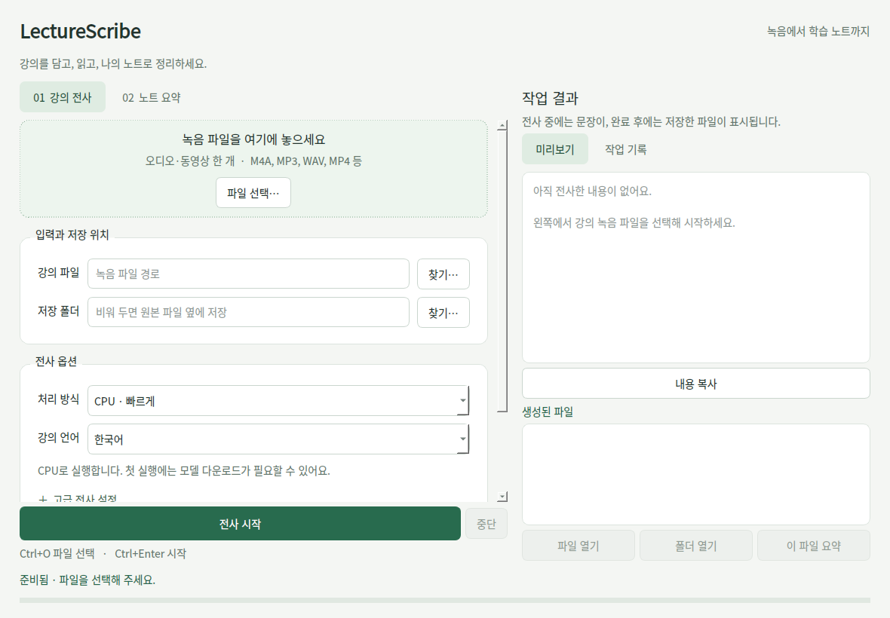

# LectureScribe

LectureScribe는 Faster-Whisper 기반 로컬 강의 전사와 OpenAI API 기반 Markdown 요약을 제공하는 데스크톱 앱 및 CLI 도구입니다.

전사는 로컬 PC에서 실행되며 `OPENAI_API_KEY` 없이 사용할 수 있습니다. 요약 탭에서 직접 요약하거나 전사 후 자동 요약을 사용할 때만 `OPENAI_API_KEY`가 필요합니다.

## 주요 기능

- 로컬 음성 전사: `faster-whisper`와 `ctranslate2` 기반 전사
- 출력 형식 선택: TXT, Markdown, SRT 저장 지원
- OpenAI 요약: 전사 Markdown을 강의 노트 형식으로 요약
- 자동 요약: 전사 완료 후 Markdown 파일을 바로 요약
- 중복 파일 보호: 같은 이름의 결과물이 있으면 `_1`, `_2` 형식으로 자동 저장
- Windows 배포: PyInstaller와 Inno Setup 기반 설치 파일 생성
- CLI: 폴더 일괄 전사, 요약 on/off, 하위 폴더 처리, LLM용 JSON Lines 출력
- 파일 끌어놓기, CPU/GPU 프리셋, 접을 수 있는 고급 설정
- 실시간 전사 미리보기, 생성 파일 목록, 복사·파일 열기·폴더 열기
- 설정과 창 크기 기억, 앱에서 이번 실행에만 사용할 API 키 입력
- 작업 중단 상태 구분, 부분 전사 저장, 안전한 종료

## 요구 사항

- Python 3.11 이상
- `uv`
- Windows 권장
- `bin/ffmpeg.exe`, `bin/ffprobe.exe`

주요 Python 의존성은 `pyproject.toml`에서 관리합니다.

- `faster-whisper`
- `huggingface-hub`
- `openai`
- `pyside6`

## 설치

일반 사용자는 GitHub Release에서 Windows 설치 파일을 내려받아 사용하는 것을 권장합니다.

1. [LectureScribe 최신 릴리즈](https://github.com/frotrue/LectureScribe/releases/latest)에 접속합니다.
2. Assets에서 `LectureScribe_Setup.exe`를 다운로드합니다.
3. 설치 파일을 실행합니다.
4. 기존 v1.1.5 설치 파일에서 요약을 사용하려면 `OPENAI_API_KEY` 환경 변수를 설정합니다. 새 개발 버전은 앱 안에서 키 입력도 지원합니다.

> 아래 새 UI·CLI·편의 기능은 개발 브랜치의 변경 사항입니다. 기존 v1.1.5 설치 파일에는 포함되어 있지 않습니다.

현재 릴리즈:

- [LectureScribe v1.1.5](https://github.com/frotrue/LectureScribe/releases/tag/v1.1.5)
- 설치 파일: [`LectureScribe_Setup.exe`](https://github.com/frotrue/LectureScribe/releases/download/v1.1.5/LectureScribe_Setup.exe)
- SHA256: `EE1B16C26CEBF90481A1D4EED9CECA49A34AF3F3AE7847A56950799E7334B791`

## 개발 환경 실행

```powershell
uv sync
uv run python main.py
```

요약 기능을 사용할 경우 `OPENAI_API_KEY`를 설정합니다.

PowerShell:

```powershell
[System.Environment]::SetEnvironmentVariable('OPENAI_API_KEY', 'your-api-key', 'User')
```

CMD:

```cmd
setx OPENAI_API_KEY "your-api-key"
```

환경 변수를 설정한 뒤에는 터미널 또는 앱을 다시 실행하세요.

## CLI로 폴더 일괄 처리

```powershell
# 폴더 전체 전사, 요약 OFF
uv run python cli.py transcribe "D:\Lectures" --recursive --summary off --output-dir "D:\LectureNotes" --json

# 전사 후 요약 ON (OPENAI_API_KEY 필요)
uv run python cli.py transcribe "D:\Lectures" --recursive --summary on --output-dir "D:\LectureNotes" --json

# 처리 대상만 확인 (다운로드·전사·API 호출 없음)
uv run python cli.py transcribe "D:\Lectures" --recursive --dry-run --json
```

GUI를 띄우지 않고 실행합니다. 배치에서는 모델을 재사용하고, 결과 폴더에 하위 폴더 구조를 유지합니다. `--json`은 LLM·스크립트용 JSON Lines 이벤트와 실제 생성된 파일 경로를 출력합니다.

GPU 옵션, 기존 전사본 요약, 출력 스키마와 종료 코드는 [CLI 문서](docs/CLI.md)를 참고하세요.

## 사용 방법




### 전사

1. `강의 전사` 탭에 녹음 파일 한 개를 끌어놓거나 `파일 선택`을 누릅니다.
2. 저장 폴더를 선택합니다. 비워 두면 원본 파일 옆에 저장합니다.
3. 처리 방식과 강의 언어를 선택합니다.
   - **CPU · 빠르게**: small / cpu / int8
   - **CPU · 정확하게**: medium / cpu / int8
   - **NVIDIA GPU · 균형**: large-v3-turbo / cuda / float16. CUDA 실행 환경이 필요합니다.
   - **직접 설정**: 고급 설정에서 모델·장치·연산 정밀도·탐색 폭을 조정합니다.
4. TXT, Markdown, SRT 중 필요한 저장 형식을 선택하고 `전사 시작`을 누릅니다.
5. 오른쪽에서 전사 중 문장을 확인하고, 완료 후 생성된 파일을 열거나 복사합니다.

전사는 로컬에서 실행되며 API 키가 필요하지 않습니다. 첫 실행에는 모델 다운로드가 필요할 수 있습니다. 프리셋의 속도와 정확도는 녹음 내용과 하드웨어에 따라 달라집니다.

### 요약

1. `노트 요약` 탭에 Markdown 또는 TXT 파일을 놓습니다. 생성된 파일 목록의 `이 파일 요약` 버튼으로도 이동할 수 있습니다.
2. API 키를 앱에서 입력하거나 기존 `OPENAI_API_KEY` 환경 변수를 사용합니다. 앱에 입력한 키는 이번 실행 동안만 사용하고 저장하지 않습니다.
3. 요약 모델을 선택하거나 모델명을 직접 입력합니다. `프롬프트·분할 크기`를 펼치면 지침과 분할 크기를 수정할 수 있습니다.
4. `요약 시작`을 누른 뒤 생성된 Markdown 파일을 확인합니다.

요약 시 전사 텍스트가 OpenAI API로 전송됩니다. API 사용료는 ChatGPT 구독과 별도입니다.

### 자동 요약

`완료 후 노트도 자동 요약`을 켜면 Markdown 출력이 자동으로 켜집니다. API 키와 요약 모델을 먼저 설정해야 합니다. 전사가 끝난 뒤 **전사를 시작할 때의 요약 설정**으로 자동 요약하며, 결과는 **해당 전사의 출력 폴더**에 저장합니다.

### 중단과 종료

- 동시에 한 작업만 실행하여 전사와 요약의 진행 상태가 섞이지 않습니다.
- 중단 요청 후 현재 모델 로딩, 처리 구간 또는 API 응답이 끝날 때까지 기다릴 수 있습니다.
- 중단한 전사에 내용이 있으면 파일명에 `_부분`을 붙여 저장합니다. 이 결과는 완성된 전사본이 아니며 자동 요약하지 않습니다.
- 요약 중단 시 진행 중인 API 응답을 기다릴 수 있습니다. 완료 전 취소된 요약은 최종 파일로 저장하지 않습니다.
- 작업 중 창을 닫으면 중단 여부를 확인하고 작업 스레드가 끝난 뒤 종료합니다.

### 편의 기능

- `Ctrl+O`: 현재 탭의 파일 선택
- `Ctrl+Enter`: 현재 탭의 작업 시작
- 고급 설정을 펼치거나 창을 작게 줄여도 시작·중단 버튼은 하단에 표시됩니다.
- 모델, 언어, 저장 형식, 출력 폴더, 요약 지침, 창 크기를 기억합니다. API 키와 전사 내용은 설정에 저장하지 않습니다.
- 생성 파일 목록은 이번 앱 실행 동안 유지됩니다. 입력·출력 파일은 기존처럼 디스크에 보관됩니다.
- 아주 큰 전사본은 미리보기만 제한합니다. `파일 열기`로 전체 내용을 확인하세요.

## 출력 파일

전사 결과는 입력 파일명을 기준으로 저장됩니다.

```text
{파일명}_원본.txt
{파일명}_원본.md
{파일명}_원본.srt
{파일명}_요약.md
```

TXT 파일은 타임스탬프가 포함된 일반 텍스트입니다.

```text
00:03 전사 문장...
01:12 다음 문장...
```

Markdown 파일은 모델, 장치, 감지 언어 정보와 타임스탬프 포함 전사본을 저장합니다.

SRT 파일은 표준 자막 형식으로 저장됩니다.

같은 이름의 파일이 이미 있으면 다음처럼 번호가 붙습니다.

```text
{파일명}_원본_1.md
{파일명}_요약_1.md
```

## 빌드

### PyInstaller

```powershell
uv run pyinstaller --noconfirm LectureScribe.spec
```

결과 폴더:

```text
dist/LectureScribe/
```

### Windows 설치 파일

1. [Inno Setup 6](https://jrsoftware.org/isdl.php)을 설치합니다.
2. `setup.iss`를 Inno Setup Compiler로 엽니다.
3. `Compile`을 실행합니다.

결과 파일:

```text
dist/LectureScribe_Setup.exe
```

## 검증

오프라인 GUI·작업 회귀 테스트:

```powershell
uv run --with pytest python -m pytest tests -q
```

테스트는 실제 Qt 위젯과 작업 스레드를 실행하고, 음성 인식 및 OpenAI API만 대체합니다. 모델을 다운로드하거나 유료 API를 호출하지 않습니다. 설정 저장, 끌어놓기, 출력 파일, 중복 방지, 중단 후 복구, 자동 요약 연결, 오류·종료 흐름과 CLI 폴더 탐색, JSON 출력, 종료 코드, 배치 중단을 검증합니다.

Windows 배포 전 확인:

1. API 키 없이 실제 오디오 전사 실행 및 TXT/MD/SRT 확인
2. CPU 및 CUDA가 준비된 NVIDIA GPU에서 각각 전사 확인
3. 실제 API 키로 수동 요약 및 자동 요약 확인
4. 전사·요약 중단과 작업 중 창 종료 확인
5. Windows 100%·150% 배율에서 화면과 버튼 확인
6. PyInstaller / Inno Setup으로 설치 파일을 빌드하고 새 설치에서 실행 확인

## 문제 해결

### `OPENAI_API_KEY` 오류

전사만 사용할 때는 API 키가 필요하지 않습니다. 요약 또는 자동 요약을 사용할 때만 요약 탭에 API 키를 입력하거나 `OPENAI_API_KEY`를 설정하세요.

### `ffmpeg` 또는 `ffprobe` 오류

`bin/ffmpeg.exe`, `bin/ffprobe.exe`가 있는지 확인하세요. PyInstaller 빌드 시에도 두 파일이 포함되어야 합니다.

### CUDA 또는 DLL 오류

GPU 실행에서 DLL 로딩 오류가 나면 NVIDIA 드라이버, CUDA 계열 패키지, `nvidia-cublas-cu12` 설치 여부를 확인하세요. CUDA 환경이 준비되지 않은 PC에서는 UI에서 장치를 `cpu`로 두고 실행하세요.

## 라이선스

이 프로젝트의 소스 코드는 [MIT License](./LICENSE)를 따릅니다.

번들 및 의존성 라이선스 정보는 [THIRD_PARTY_NOTICES.md](./THIRD_PARTY_NOTICES.md)를 확인하세요.
